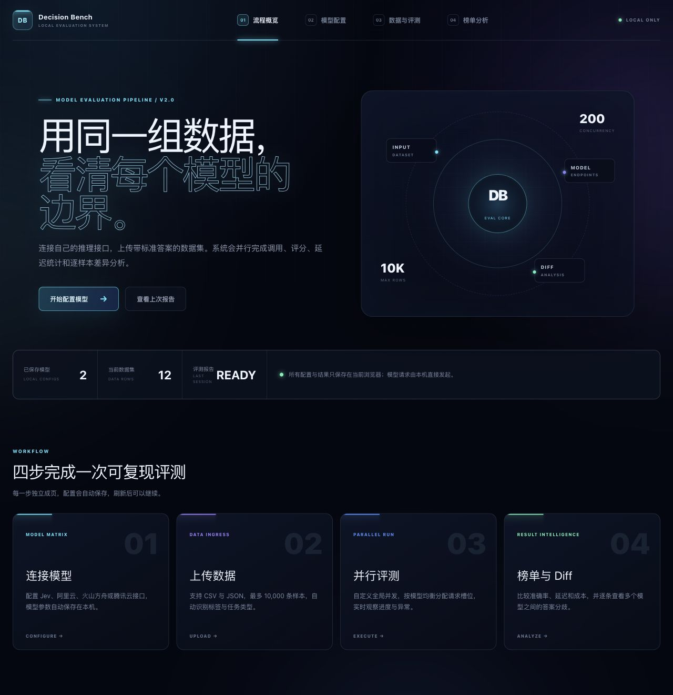
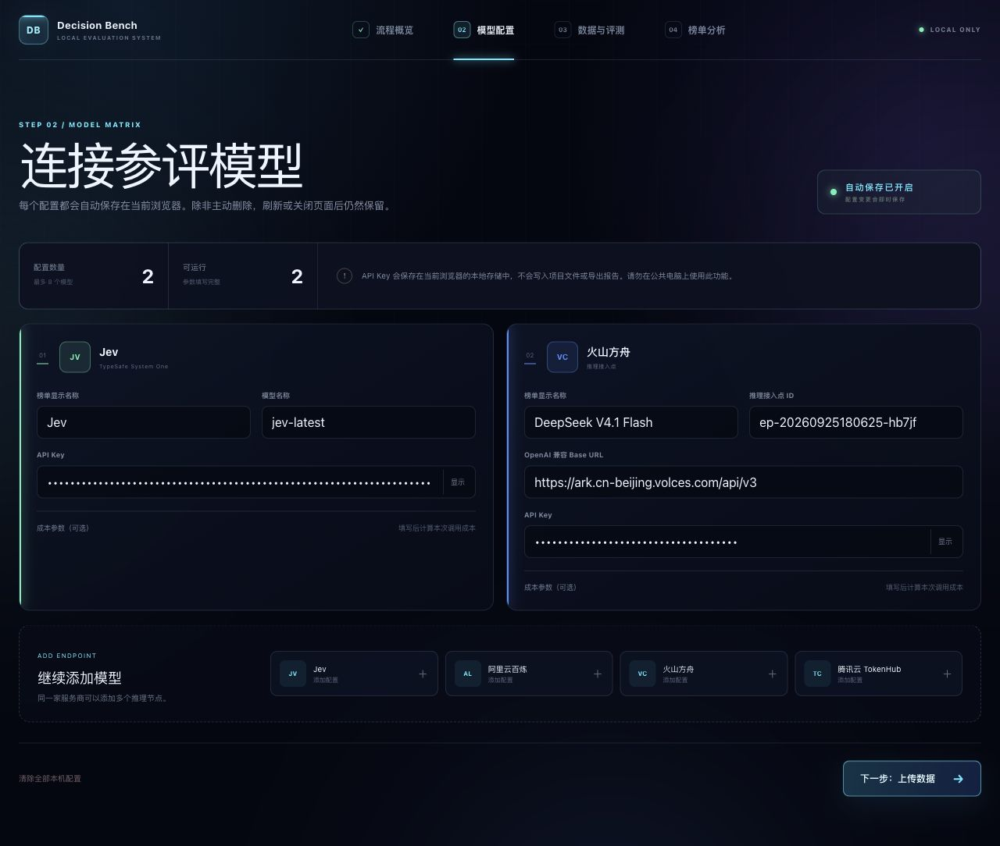
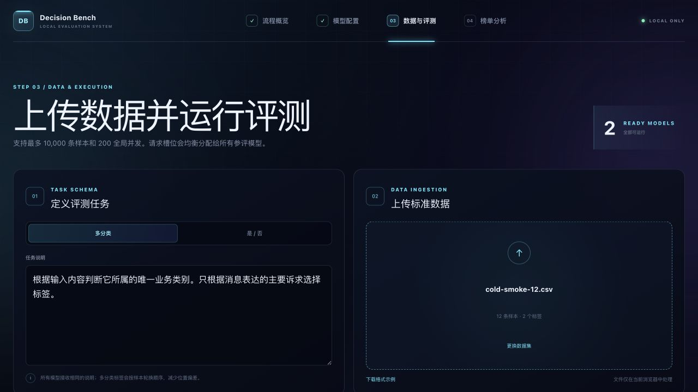
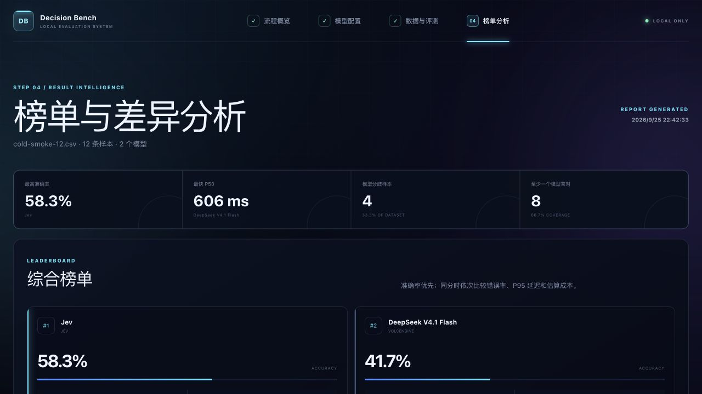
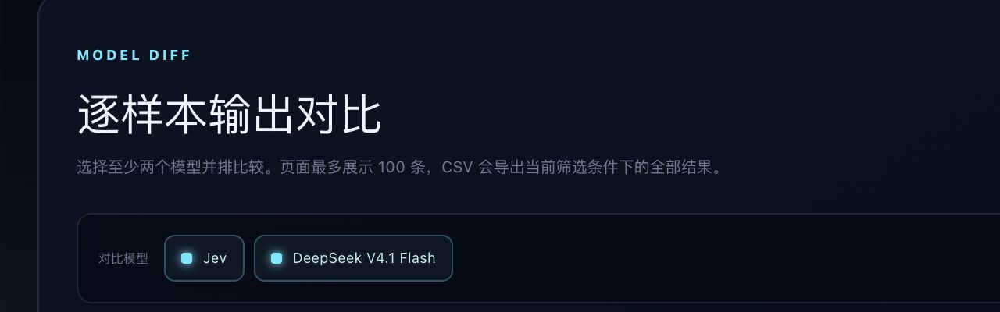

# Jev Decision Bench

一个在本地运行的多模型决策评测平台。把同一份带标准答案的数据同时交给 Jev 和其他大模型，自动比较准确率、Macro-F1、错误率、延迟与成本，并逐条查看模型之间的输出差异。

它适合评测分类、路由、审核、是否判断等“答案空间明确”的任务，不用于评价写作、总结、代码生成等开放式生成能力。



## 能做什么

- 在页面中配置 Jev、阿里云百炼、火山方舟和腾讯云 TokenHub 的推理接口。
- 同时评测 2—8 个模型；同一家服务商可配置多个模型或推理节点。
- 支持多分类和是／否两类任务。
- 上传 CSV 或 JSON 数据集，单次最多 10,000 条。
- 自定义 1—200 的全局并发数，并将并发槽位均衡分给参评模型。
- 实时查看各模型进度、调用异常和总体完成度。
- 自动生成准确率、Macro-F1、P50/P95 延迟、错误率和估算成本榜单。
- 选择多个模型做逐样本 Diff；页面展示前 100 条，完整结果可导出 CSV。
- 模型配置、数据集和报告自动保存在当前浏览器，刷新后可以继续。

> 本项目与俄罗斯方块演示是两个完全独立的项目。仓库中不包含游戏页面、游戏接口或跳转入口。

## 页面预览

| 模型配置 | 数据与评测 |
| --- | --- |
|  |  |

| 榜单与 Diff 分析 |
| --- |
|  |

## 环境要求

- Node.js 22.13 或更高版本
- npm（随 Node.js 安装）
- 可以访问所配置模型服务的网络
- 建议使用最新版 Chrome、Edge 或 Safari

## 一键启动

### macOS

下载并解压仓库后，双击 `start-local.command`。

如果系统第一次阻止运行，可以右键文件选择“打开”；也可以在终端中运行：

```bash
chmod +x start-local.command
./start-local.command
```

### Windows

下载并解压仓库后，双击 `start-local.bat`。

### 命令行

```bash
npm install
npm run dev -- --port 3000
```

浏览器打开 <http://localhost:3000/>。

## 完成一次评测

### 1. 配置模型

打开“模型配置”，至少填写两个可运行的模型。配置会自动保存到当前浏览器，只有主动点击“清除全部本机配置”才会删除。


| 服务商 | 需要填写 | 默认 API 地址或说明 |
| --- | --- | --- |
| Jev | API Key、模型名称 | 请求固定发送到 `https://api.typesafe.ai/v1/systemone`；默认模型为 `jev-latest` |
| 阿里云百炼 | API Key、模型名称、兼容模式 Base URL | 支持 `dashscope.aliyuncs.com` 与 `maas.aliyuncs.com` 域名 |
| 火山方舟 | API Key、推理接入点 ID | 默认 Base URL：`https://ark.cn-beijing.volces.com/api/v3` |
| 腾讯云 TokenHub | API Key、模型名称 | 默认 Base URL：`https://tokenhub.tencentcloudmaas.com/v1` |

普通大模型通过 OpenAI 兼容的 `chat/completions` 接口调用。为降低配置错误和服务端请求伪造风险，后端只允许访问上述服务商的官方域名，且只接受 HTTPS。

### 2. 选择任务并上传数据

打开“数据与评测”，选择任务类型：

- **多分类**：每条样本只能有一个正确标签，整个数据集支持 2—100 个标签。
- **是／否**：标准答案会统一转换为 `true` 或 `false`。

填写一段对所有模型都相同的任务说明，然后上传 CSV 或 JSON 文件。平台会展示前 5 条样本和识别出的标签，建议先检查预览再运行。


### 3. 设置并发并运行

全局并发范围为 1—200，但不能小于参评模型数。例如设置 20 并发、配置 4 个模型时，每个模型会分到 5 个独立请求槽位。

并发越高不一定越快。请根据各服务商的 RPM、TPM 和账户配额逐步增加；大量 `429` 错误通常意味着触发了限流。

### 4. 查看榜单与 Diff

评测完成后进入“榜单分析”：

- 榜单按准确率排序；同分时依次比较错误率、P95 延迟和估算成本。
- 可以勾选多个模型并排查看同一条样本的预测、耗时、原始输出和错误信息。
- 可以只看模型分歧、至少一个模型答错或全部样本。
- 页面最多渲染 100 条，导出的 CSV 包含当前筛选条件下的全部数据。




## 数据格式

平台不会自动理解任意业务文件。请将数据整理成“输入 + 唯一标准答案”的监督评测格式。

### CSV

至少包含 `input` 和 `expected` 两列；`id`、`context` 可选。

```csv
id,input,expected,context
1,"我的包裹显示签收了但没有收到","订单物流","用户已经等待三天"
2,"钱扣了两次请马上处理","退款售后",""
```

内容中含逗号或换行时，请用英文双引号包裹。文件建议使用 UTF-8 编码。

### JSON

可以直接使用数组：

```json
[
  {
    "id": "1",
    "input": "怎么申请退款",
    "expected": "退款售后",
    "context": "订单尚未发货"
  },
  {
    "id": "2",
    "input": "账号登录不上",
    "expected": "账号问题"
  }
]
```

也支持将数组放在 `data` 字段中：

```json
{ "data": [{ "input": "怎么申请退款", "expected": "退款售后" }] }
```

### 字段说明

| 字段 | 是否必填 | 说明 | 可识别别名 |
| --- | --- | --- | --- |
| `input` | 是 | 发送给模型的文本、问题或消息 | `text`、`query`、`content`、`message`、`输入`、`文本`、`问题`、`消息` |
| `expected` | 是 | 唯一标准答案或分类标签 | `label`、`answer`、`target`、`标准答案`、`标签`、`答案`、`分类` |
| `id` | 否 | 样本编号；省略时自动生成 | `编号`、`序号` |
| `context` | 否 | 提供给模型的背景信息 | `上下文`、`背景` |

是／否任务支持以下标准答案：

- 真：`true`、`yes`、`1`、`是`、`正确`、`符合`
- 假：`false`、`no`、`0`、`否`、`错误`、`不符合`

当前限制：

- 单次最多 10,000 条样本。
- 不支持 Excel、JSONL、嵌套题目和多标签答案。
- 每条输入最长 30,000 个字符，任务说明最长 4,000 个字符。
- 多分类任务最多 100 个候选标签。

仓库内提供三个可直接上传的示例：

- `public/samples/customer-routing.csv`：多分类客服路由。
- `public/samples/human-handoff.csv`：是否需要人工介入。
- `public/samples/customer-routing.json`：JSON 格式示例。

## 指标如何计算

| 指标 | 含义 |
| --- | --- |
| Accuracy | 正确预测数 ÷ 已完成样本数；接口错误也计为未答对 |
| Macro-F1 | 先分别计算每个标签的 F1，再做等权平均，适合观察小类别表现 |
| P50 / P95 | 单次模型请求延迟的中位数和第 95 百分位；不含页面渲染时间 |
| 错误率 | 超时、接口报错或无法解析的结果占全部调用的比例 |
| 估算成本 | 按模型配置中的输入、输出单价和接口返回的 Token 用量估算 |

成本只是估算值。如果服务商没有返回 Token 用量，或没有填写价格，结果会显示为 `$0.0000`，不代表真实调用免费。

## 公平性与可复现性设计

- 所有模型接收相同的任务说明、输入和上下文。
- 普通 LLM 的温度固定为 0，并要求只返回指定 JSON。
- 多分类标签会按样本轮换顺序，降低固定位置造成的选择偏差。
- 每个模型使用独立请求队列，并发槽位尽量均分。
- 运行结果、当次模型配置和生成时间一起保存在本机。

云端模型仍可能升级或存在非确定性。正式报告应同时记录模型版本、推理节点、日期、数据抽样方法和并发设置。

## 数据与密钥安全

- API Key 保存在当前浏览器的 `localStorage`，不会写入仓库或导出的 CSV。
- 数据集与评测结果保存在当前浏览器的 IndexedDB。
- 调用时，API Key 和当前样本会先发送到本机的 `/api/benchmark/evaluate`，再由本机服务转发给所选模型服务商。
- 数据不会上传到本项目作者的服务器，但会发送给你配置的模型提供商；请遵守相应服务的隐私和数据处理条款。
- 不要在公共电脑保存真实密钥，也不要把本地服务直接暴露到公网。

如果需要彻底清理：在“模型配置”中删除模型配置，并清除该站点的浏览器数据。

## 项目结构

```text
app/
├── api/benchmark/evaluate/route.ts  # Jev 与各云厂商的本地转发和结果解析
├── benchmark/                       # 配置、运行、榜单、解析和本机存储
├── models/page.tsx                  # 模型配置页
├── run/page.tsx                     # 数据上传与评测页
├── leaderboard/page.tsx             # 榜单与 Diff 页
└── page.tsx                         # 流程首页
public/
├── datasets/                        # 带来源说明的小型公开冒烟测试集
└── samples/                         # CSV / JSON 格式示例
tests/                               # 页面构建与项目边界测试
```

## 常见问题

### 为什么模型配置完整，运行时仍然报错？

先检查 API Key、模型名称或推理接入点 ID，再确认 Base URL 与所选服务商匹配。平台会拒绝非官方域名和 HTTP 地址。

### 为什么大量请求返回 429？

当前并发超过了账号或推理节点的速率限制。降低全局并发后重新运行。

### 为什么估算成本是 0？

需要同时满足两个条件：模型接口返回 Token 用量，并且你在模型配置中填写了输入／输出单价。

### 能否用于回归、生成质量或多标签任务？

当前版本只支持多分类和是／否判断。开放式生成任务需要自定义评分器，不在本项目范围内。

## 开发与检查

```bash
npm install
npm run dev
npm run lint
npm test
```

`npm test` 会先完成生产构建，再检查四个页面能够正常渲染，并确认仓库页面中没有俄罗斯方块项目内容或硬编码 API Key。
